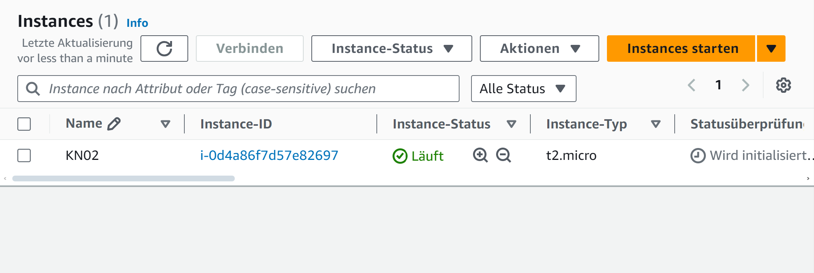
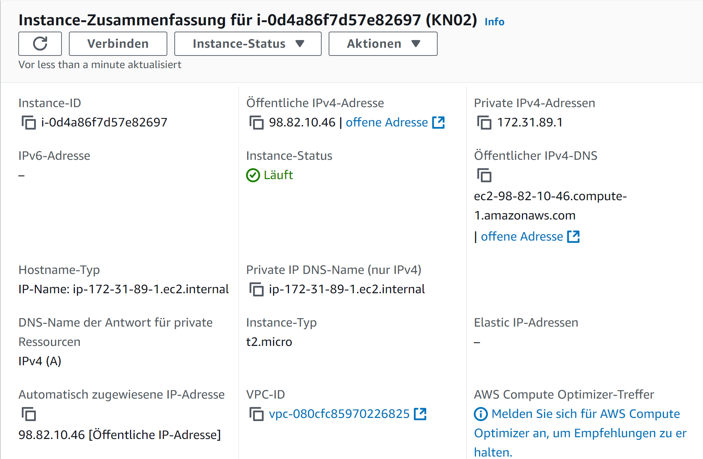
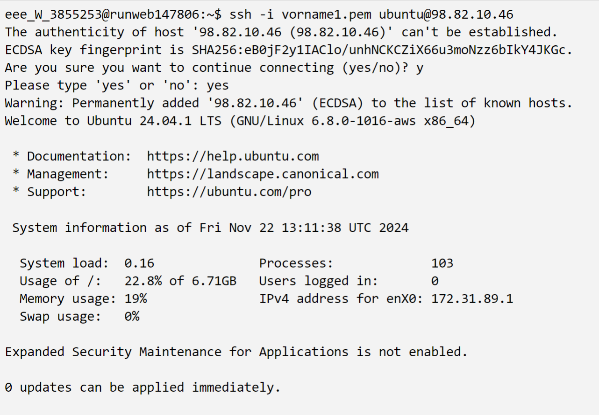
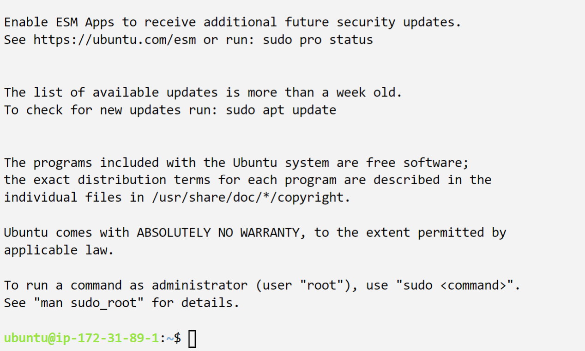
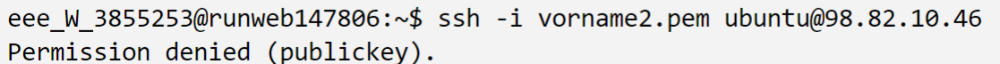
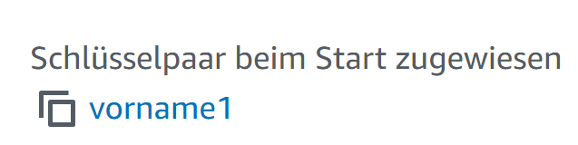

# AWS EC2 Instanz: KN02

## Instanz-Details

Liste der Instanzen
 

Details der Instanz
 

## Ressourcen

- **Diskgröße:** 8GB
- **Betriebssystem:** Ubuntu 24.04
- **RAM:** Nicht gefunden
- **CPUs:** 1 vCPU.

---

# SSH-Verbindungen und Instanz-Details

## SSH-Befehl und Ergebnis mit dem **ersten Schlüssel**

---

## SSH-Befehl und Ergebnis mit dem **zweiten Schlüssel**

---

## Verwendeter Schlüssel: 

