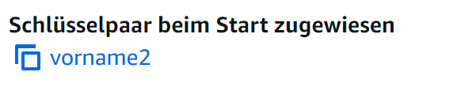
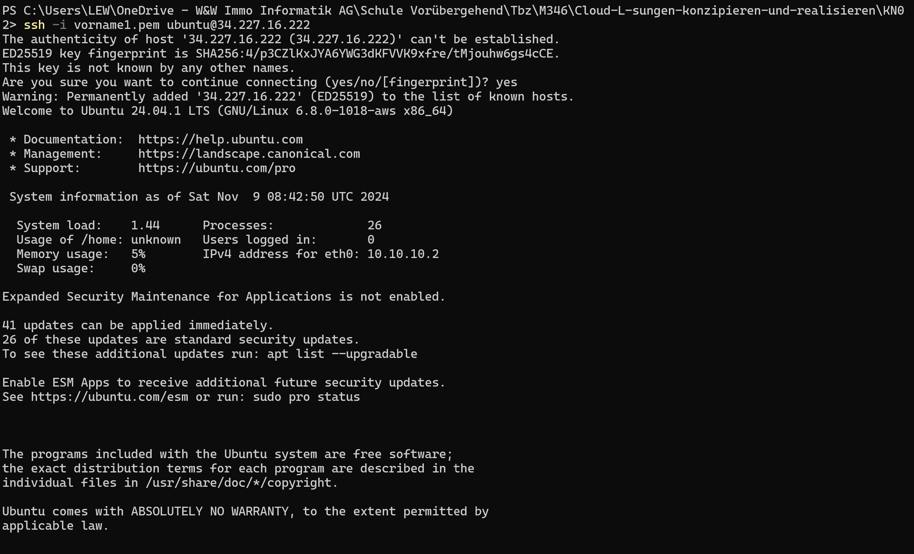
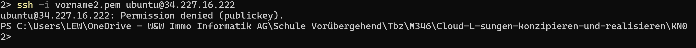
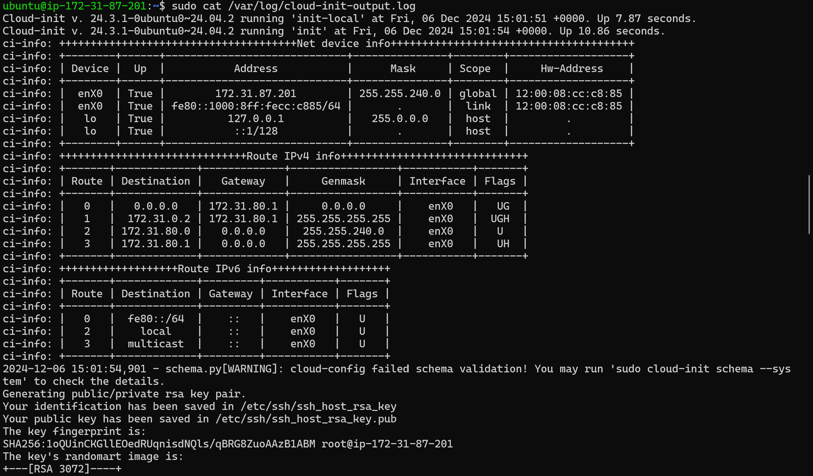
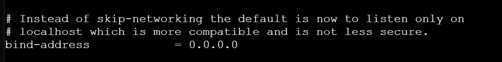
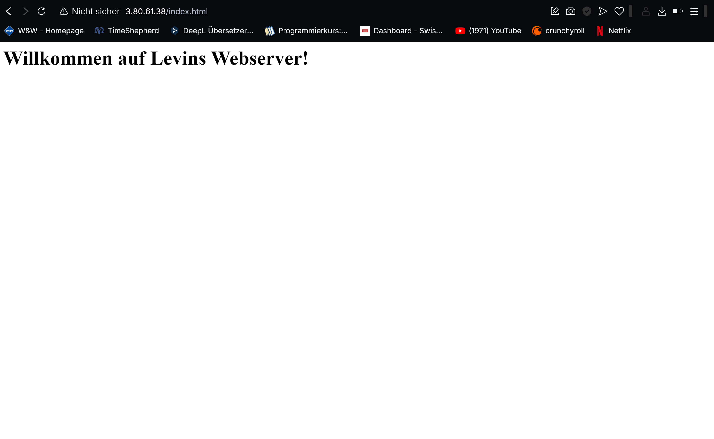
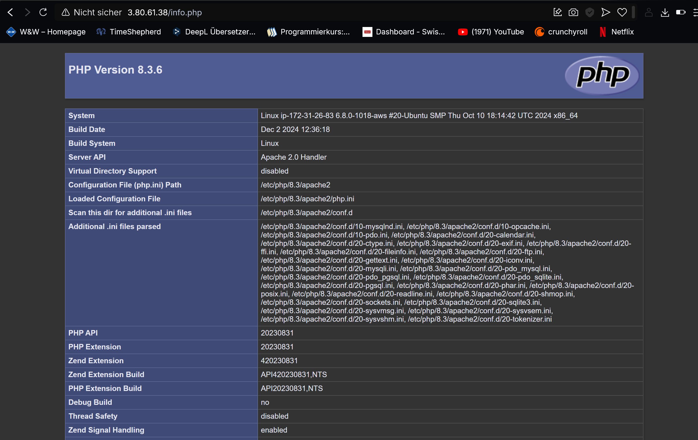
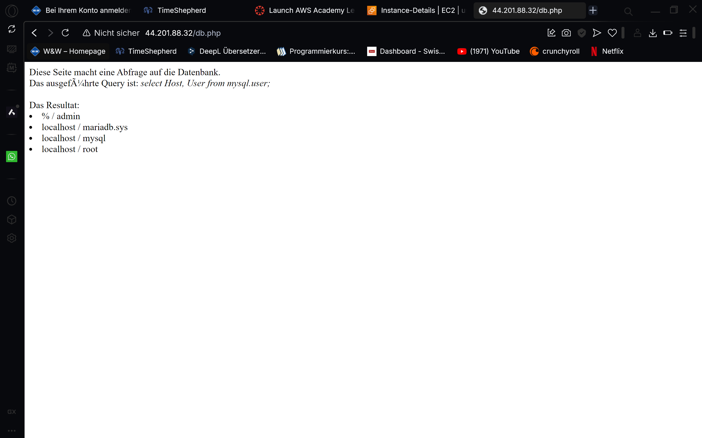

# KN04: Cloud-init und AWS

## Abgaben

1. **InstanzDetails**
- 

---

2. **Verbindung mit Key 1 und 2**
- 
- 
- 

---

3. **Cloud-Init-Log-Datei**
- 

---

4. **Geänderte Konfigurationsdatei**

- 

3. **Abgabe Webserver**:

- 
- 
- 

   - **Screenshots**:
     - Aufruf von `index.html`, `info.php`, und `db.php` (URL und Inhalt sichtbar).
     - Verbindung zu Adminer (`http://<IP>/adminer/`) und Verbindung zum DB-Server.