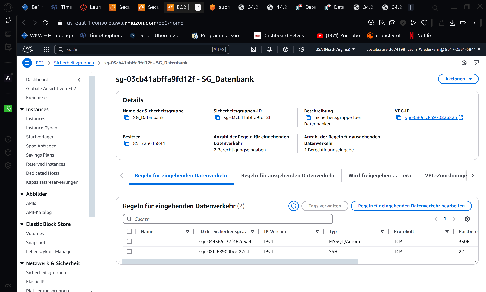

# KN05: Netzwerk / Sicherheit

## Erklärung VPC & Subnet

### VPC (Virtual Private Cloud):
Ein isoliertes Netzwerk in der AWS-Cloud, in dem Ressourcen wie EC2-Instanzen betrieben werden. Die VPC bietet die Möglichkeit, den IP-Adressbereich (CIDR) und Sicherheitsregeln zu definieren.

### Subnet (Subnetz):
Ein Teilnetz innerhalb der VPC, das einen kleineren IP-Bereich abdeckt. Subnetze können öffentlich (mit Internetzugang) oder privat sein und sind an spezifische Availability Zones gebunden.

## IP-Adressbereich der VPC:
Die VPC hat den IP-Adressbereich `172.31.0.0/16`, was insgesamt **65.536 Adressen** umfasst.

### Subnetze der VPC:
Die Subnetze teilen den IP-Bereich der VPC in kleinere Abschnitte auf. Jedes Subnetz hat den Bereich `/20`, der **4.096 Adressen** abdeckt. Die folgende Tabelle zeigt die Konfiguration der Subnetze:

| Subnetz      | CIDR-Bereich      | Anzahl Adressen |
|--------------|-------------------|-----------------|
| Subnetz 1    | 172.31.16.0/20    | 4.096           |
| Subnetz 2    | 172.31.0.0/20     | 4.096           |
| Subnetz 3    | 172.31.80.0/20    | 4.096           |
| Subnetz 4    | 172.31.32.0/20    | 4.096           |
| Subnetz 5    | 172.31.64.0/20    | 4.096           |
| Subnetz 6    | 172.31.48.0/20    | 4.096           |

Zusammen decken die Subnetze **24.576 Adressen** ab. Der gesamte IP-Bereich der VPC (65.536 Adressen) wird somit nicht vollständig genutzt.

## IP-Adressen

### Öffentliche IP:
Eine IP-Adresse, die im Internet sichtbar ist und direkt für die Kommunikation mit externen Diensten verwendet wird.

**Beispiel:** Zugriff auf eine Webseite.

### Private IP:
Eine IP-Adresse, die nur innerhalb eines privaten Netzwerks sichtbar ist und nicht direkt aus dem Internet erreichbar ist.

**Beispiel:** Kommunikation zwischen internen Ressourcen.

### Statische IP:
Eine feste, unveränderliche IP-Adresse, die einer Ressource dauerhaft zugewiesen wird und auch nach einem Neustart erhalten bleibt.

## Ressourcenzuordnung:

| Ressource | IP-Adresse       |
|-----------|------------------|
| DB        | 172.31.64.10     |
| WEB       | 172.31.64.20     |

## Subnetz-Liste

