# KN06: Skalierung

## A) Installation App 

### Reverse Proxy
Ein Reverse Proxy liegt vor mehreren Servern. Er nimmt die Pakete an inspektiert diese und leitet diese dann an den richtigen Server.

### Cloud-Init Probleme
Man sollte die Benutzerdaten für das Login nicht im Klartext ins File einfügen.

Unnötig dass das Proxy File zuerst im Home erstellt wird und danach kopiert wird.

## B) Vertikale Skalierung

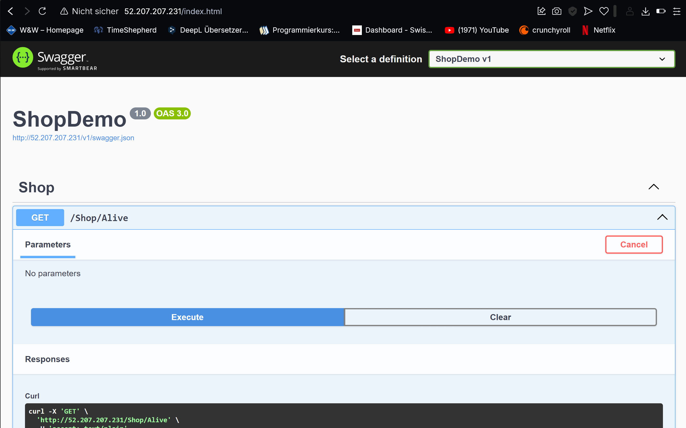
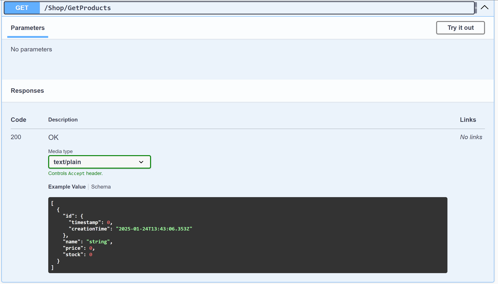
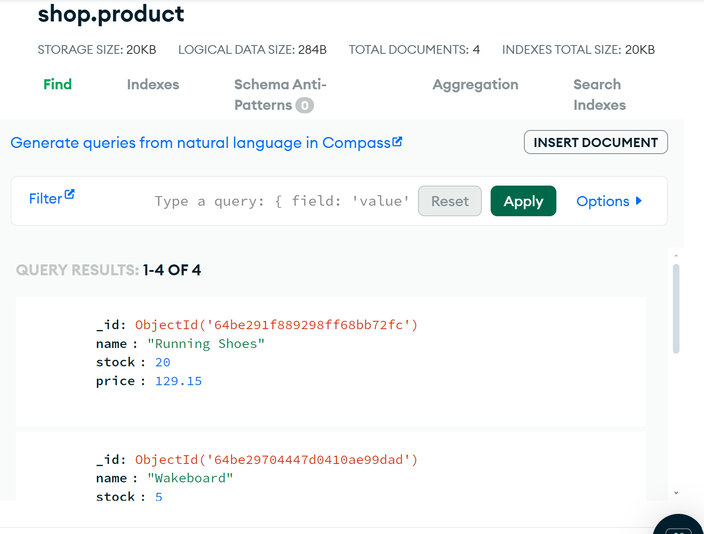

### Erklärung:

In der Instanz unter Storage, findet man die aktuelle Disk.

Auf die Disk klicken.

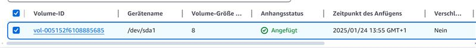

Dann oben rechts unter Actions > Modify Volume kann man die Disk Grösse erhöhen

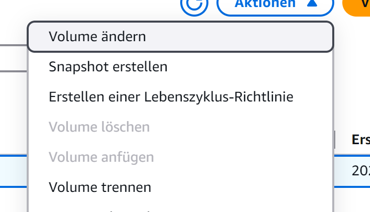
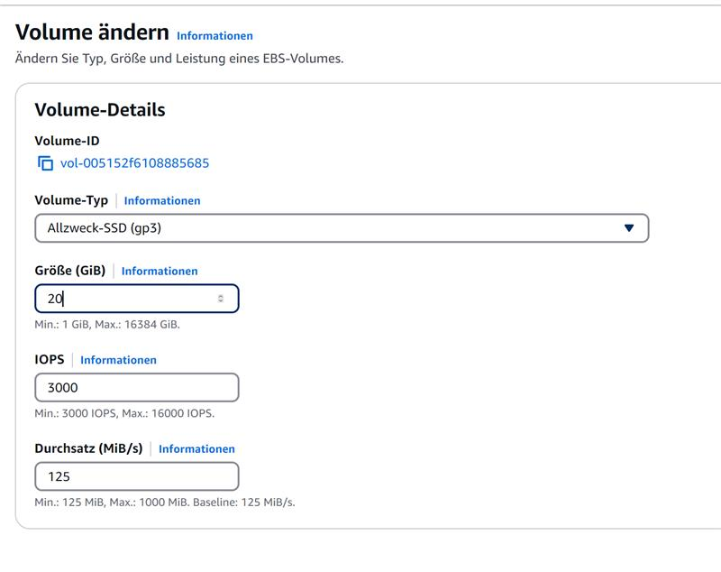

Um den Instanz Typ zu ändern muss man zuerst die Instanz stoppen.

Dann unter "Actions > Instance Settings > Change Instance Type" kann man den neuen Instanztyp auswählen.

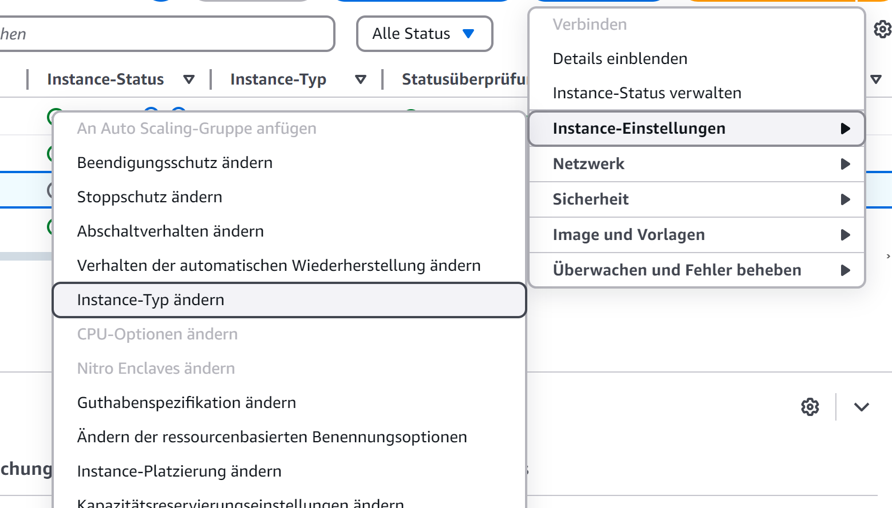
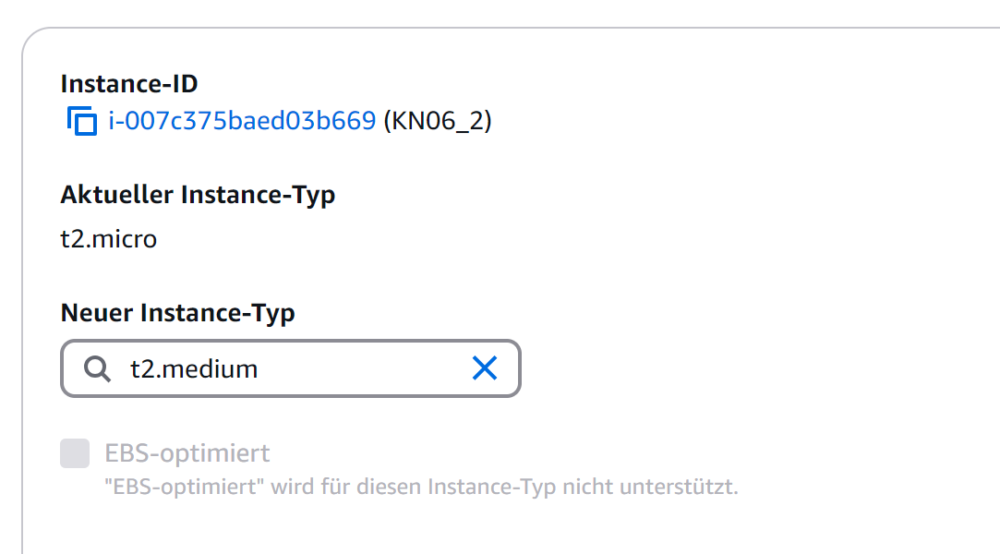

### Nachher

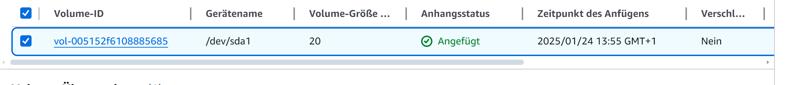
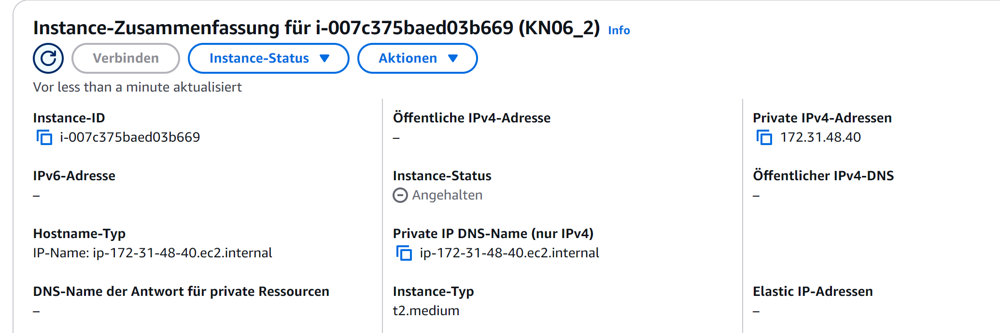
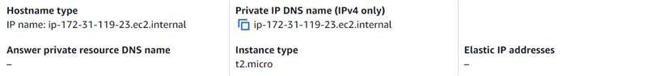

## C) Horizontale Skalierung

Um die Webserver mit der URL app.tbz-m346.ch zu erreichen, müsste man einen CNAME RECORD erstellen und dort die bestehende URL von aws einfügen.

Hier sieht man noch, dass der Load Balancer funktioniert.

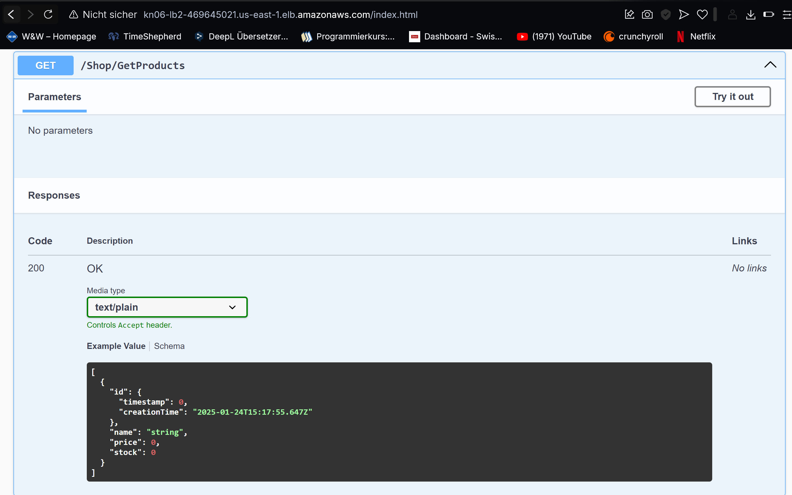
