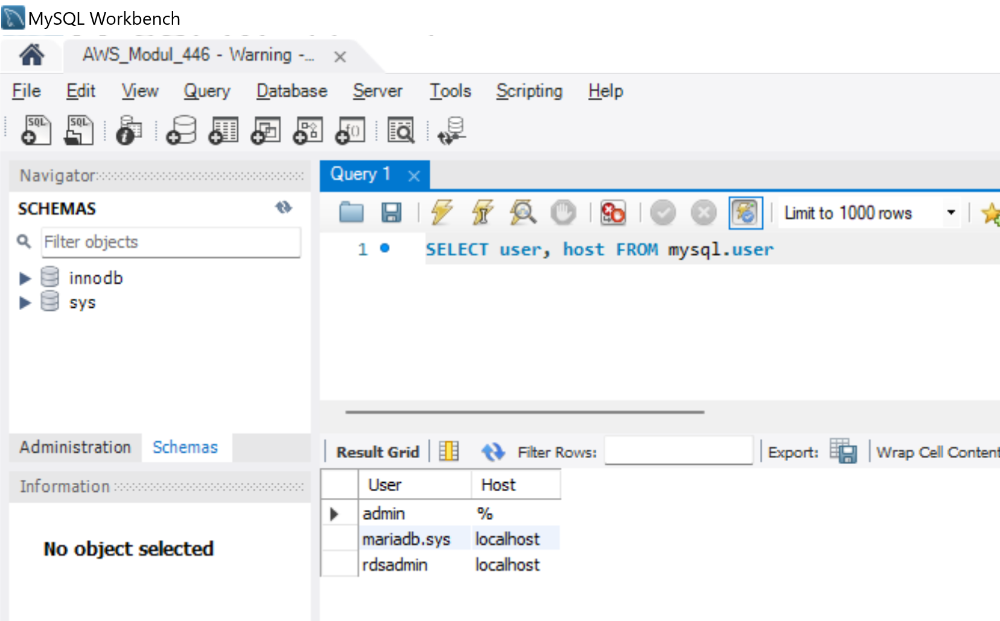
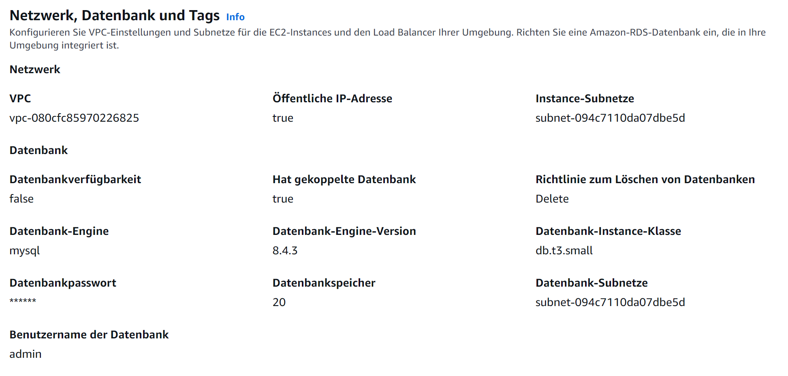
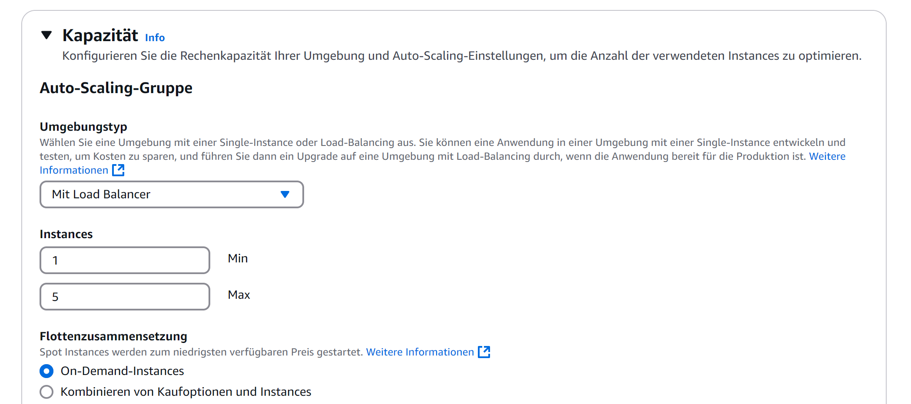
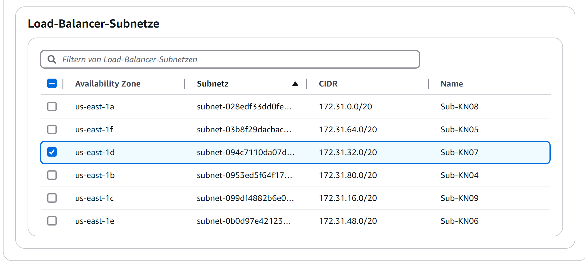
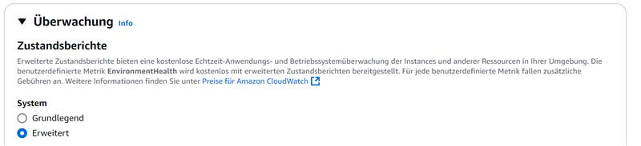
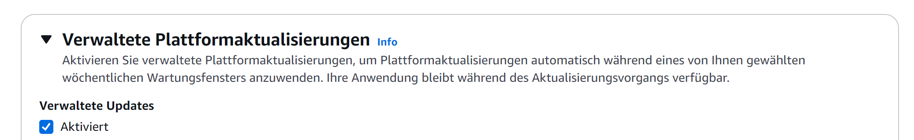
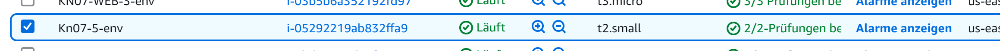
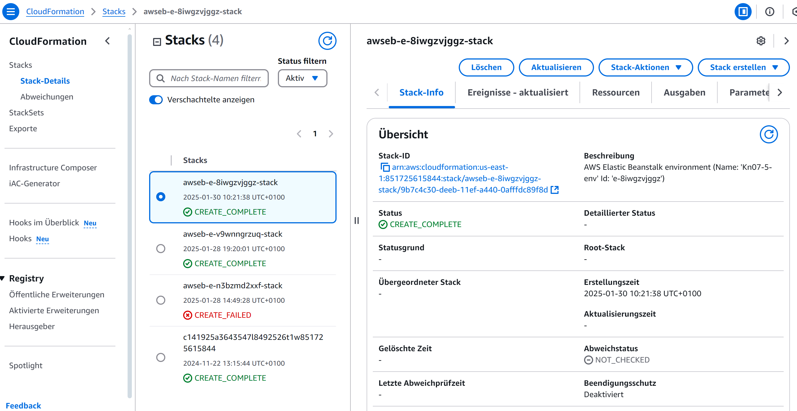

# KN07: PAAS

## A) Datenbank im PAAS Modell

### Wieso PAAS/SAAS anstatt einer eigenen Datenbank?

- Die Wartung, Sicherstellung der Verfügbarkeit und das Skalieren der Datenbank wird von den Anbietern übernommen.
- Die Kosten für Mitarbeiter, die sich um die Server kümmern, sind wahrscheinlich höher als die Kosten für eine PAAS oder SAAS Datenbank.

## B) PAAS Applikation erstellen

### Veränderte Bereiche:

### Datenbankabfrage

Wir erstellen eine MySQL-Datenbank für das Applikations-Environment. Somit wird die Datenbank in der Applikation verwendet.

---

### Auto Scaling aktivieren

Wir können direkt in den Environment-Einstellungen das Auto Scaling aktivieren – weshalb also nicht?

---

### Subnet auswählen

Wir wählen das Subnet aus, in dem die Applikation laufen soll.

---

### Monitoring aktivieren

Wir aktivieren das Monitoring für die Applikation und stellen dieses auf "Erweitert".

---

### Managed Platform Updates aktivieren

Mit den erweiterten Monitoring-Einstellungen können wir die Managed Platform Updates aktivieren.

## B) Erstellte Ressourcen/Objekte und ColoudFormation

### Was ist CloudFormation?
AWS CloudFormation ist ein Service, der es ermöglicht, Infrastruktur als Code zu erstellen und zu verwalten. Mit CloudFormation können Sie eine Vorlage erstellen, die die Ressourcen und Konfigurationen definiert, die Sie in Ihrer AWS-Umgebung bereitstellen möchten. Sie können die Vorlage dann verwenden, um die Infrastruktur in Ihrer AWS-Umgebung zu erstellen und zu verwalten.

### Erstellte Instanz

### Erstellte Security Group

### Load Balancer

### Cloud Formation Ressourcen
