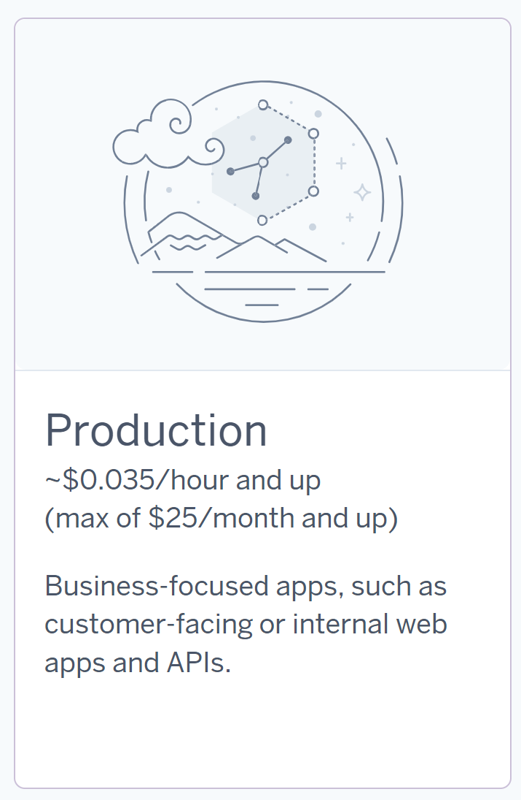
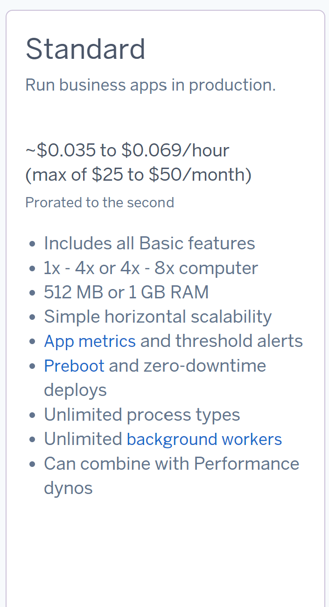
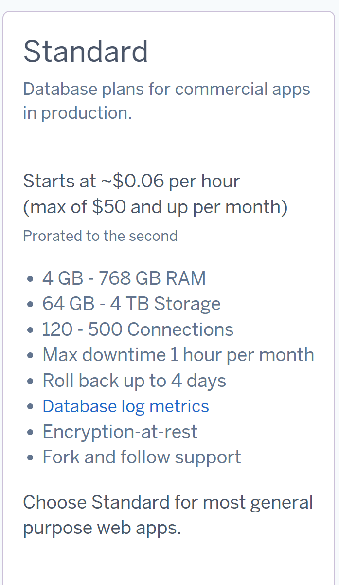

# README: Kostenvergleich und Bewertung von Cloud-Migrationsstrategien

Herr Atilgan,
dieses Dokument bietet eine Übersicht zu den Kosten und dem Aufwand der Cloud-Migrationsstrategien (IaaS, PaaS, SaaS) sowie meine Bewertung zu den Optionen basierend auf unseren bisherigen Anforderungen.

---

## Kostenvergleich

### Infrastructure-as-a-Service (IaaS)
#### Amazon Web Services (AWS)
- **Webserver**: 12,99 €/Monat

- **Datenbank**: 193,99 €/Monat

- **Backup**: 35,20 €/Monat

- **Gesamtkosten**: 242,18 €/Monat

#### Microsoft Azure
- **Webserver**: 12,29 €/Monat

- **Datenbank**: 143,37 €/Monat

- **Backup**: 39,60 €/Monat

- **Gesamtkosten**: 195,26 €/Monat

### Platform-as-a-Service (PaaS)
- **Heroku**: Kosten variieren je nach Nutzung (siehe Detaildokumentation).

### Software-as-a-Service (SaaS)
#### Zoho CRM
- **Kosten**: 690 €/Monat (23 €/User für 30 User)

#### Salesforce
- **Kosten**: 750 €/Monat (25 €/User für 30 User)

---

## Aufwand für die Firma

### IaaS (AWS, Azure)
- Höherer technischer Aufwand (z. B. Einrichtung, Datenmigration, Verwaltung).

### PaaS (Heroku)
- Reduzierter Verwaltungsaufwand durch automatisierte Plattformdienste.
- Anpassungen möglich, aber eingeschränkte Kontrolle.

### SaaS (Zoho CRM, Salesforce)
- Minimaler technischer Aufwand.
- Fokus auf Schulung und Workflow-Integration.

---

## Erklärung zur Auswahl der Cloud-Komponenten und Abweichungen zur bisherigen On-Premise-Infrastruktur

### 1. Webserver
#### On-Premise Infrastruktur:
- 1 Core, 2 GB RAM, 20 GB Speicher, Ubuntu.
- Der Webserver ist einfach konfiguriert und dient eigentlich nur zur Bereitstellung der Anwendung.

#### Cloud-Komponente:
- **AWS**: Amazon EC2 (t3.small: 2 vCPUs, 2 GiB RAM).
- **Azure**: Virtual Machine (B1ms: 1 vCPU, 2 GB RAM, 4 GB Temporary Storage, S4 32 GiB, Saving Plan 3 Jahre).

#### Abweichungen und Gründe:
- Die kleinsten verfügbaren Instanzen in der Cloud sind meistens leistungsstärker und bieten mehr Ressourcen (z. B. 2 vCPUs bei AWS).
- Die Speichergröße (20 GB) wird durch die Festplattenoption bereitgestellt.
- **Gründe**:
  - Die Wahl fiel auf die günstigsten Instanzen, die den Anforderungen entsprechen.
  - Vorteil: Skalierbarkeit. Bei Bedarf können die Ressourcen schnell angepasst werden.
  - Grund für Abweichung: Cloud-Instanzen sind vorab definiert, daher keine 1:1 Anpassung möglich.

### 2. Datenbankserver
#### On-Premise Infrastruktur:
- 2 Cores, 4 GB RAM, 100 GB Speicher, Ubuntu.
- Datenbankserver wurde manuell verwaltet.

#### Cloud-Komponente:
- **AWS**: Amazon RDS (db.t3.medium: 2 vCPUs, 4 GiB RAM, 100 GB Storage).
- **Azure**: Azure SQL Database (General Purpose, 2 vCores, 4 GB RAM, 100 GB Speicher).

#### Abweichungen und Gründe:
- **Managed Service**:
  - Statt einer selbst verwalteten VM wurde ein Managed Database Service gewählt.
  - Vorteil: Automatisierte Backups und Upgrades.
  - Grund für Abweichung: Der Betrieb eines Managed Service reduziert den administrativen Aufwand und die Fehlerquellen.
- **Speichergröße**:
  - Die Spezifikationen (100 GB) wurden übernommen, mit der Möglichkeit, sie bei Bedarf zu skalieren.
- **Performance**:
  - RDS und Azure SQL bieten eine optimierte Umgebung für Datenbanken (natürlich besser als eine manuelle Installation auf einer VM).

### 3. Backups
#### On-Premise Infrastruktur:
- Manuelle Speicherung der Backups auf lokalem Speicher.
- **Backup-Plan:**
  - Täglich für die letzten 7 Tage.
  - Wöchentlich für den letzten Monat.
  - Monatlich für die letzten 3 Monate.

#### Cloud-Komponente:
- **AWS**:
  - Tägliche Backups: Amazon S3 Standard.
  - Wöchentliche Backups: Amazon S3 Infrequent Access.
  - Monatliche Backups: Amazon S3 Glacier (bzw. Deep Archive).
- **Azure**:
  - Tägliche Backups: Blob Storage Hot Tier.
  - Wöchentliche Backups: Blob Storage Cool Tier.
  - Monatliche Backups: Blob Storage Archive Tier.

#### Abweichungen und Gründe:
- **Kosteneffizienz**:
  - Statt eines einheitlichen Speichers (wie bei On-Premise) wurde eine abgestufte Speicherlösung gewählt.
  - Cool Backups sind günstiger als heiße Speicheroptionen.
- **Zugriffszeiten**:
  - Tägliche Backups bleiben schnell verfügbar (Hot).
  - Wöchentliche/monatliche Backups werden seltener benötigt und können daher in günstigeren Stufen gespeichert werden (Cool/Archive).
- **Sicherheit und Redundanz**:
  - Cloud-Backups werden in verteilten Regionen gespeichert, was bei On-Premise nicht möglich ist.

### 4. Skalierbarkeit und Verfügbarkeit
#### On-Premise Infrastruktur:
- Die Ressourcen waren festgelegt, ohne Skalierungsmöglichkeiten.
- Bei Ausfällen mussten die Hardware-Reparaturen manuell erledigt werden.

#### Cloud-Komponente:
- Cloud-Instanzen und Services sind skalierbar und bieten eine hohe Verfügbarkeit (z. B. durch Multi-AZ bei RDS oder Azure SQL).

#### Abweichungen und Gründe:
- **Automatisches Scaling**:
  - Cloud-Ressourcen können bei Bedarf automatisch erhöht oder verringert werden, was bei On-Premise nicht möglich ist.
- **Redundanz**:
  - Durch Cloud-Regionen und Verfügbarkeitszonen werden Ausfallzeiten minimiert.

---

## Fazit
- **Günstigste Optionen**: Azure (IaaS) und Zoho CRM (SaaS).
- **Minimaler Aufwand**: SaaS (Zoho CRM, Salesforce).
- **Langfristige Flexibilität**: AWS oder Azure (IaaS).

Die Wahl der Strategie sollte von den Anforderungen an Kosten, Aufwand und langfristige Flexibilität abhängen.